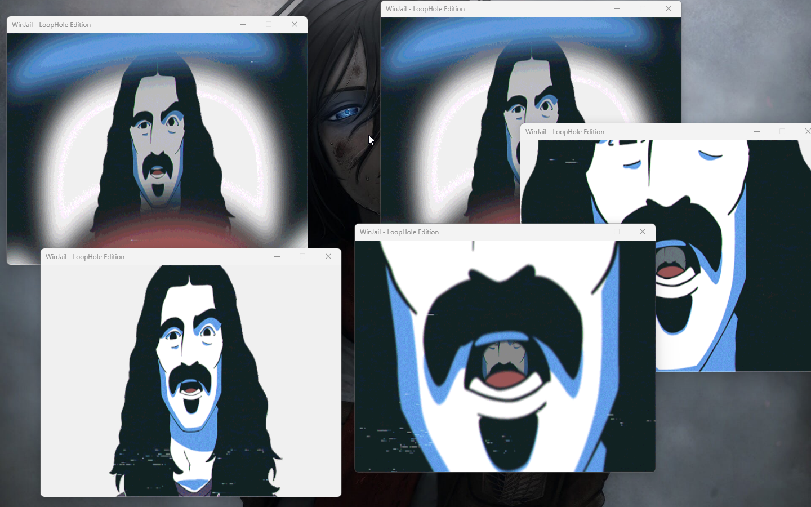

# WinJail - LoopHole Edition

WinJail is a fun side project inspired by Scammer Payback. It mimics a fake malware trap by reopening multiple windows every time you try to close one. It features:

- Creepy message boxes
- Red-tinted window overlay
- Randomized window spawning

## ⚠️ Disclaimer

**This is for educational and entertainment purposes only. Do not use it to harm or prank others without consent.**

## 🧱 Features

- Prevents easy closure
- Random spooky messages
- Custom window positioning
- Fun project built with C# WinForms

## 🚀 How to Run

1. Clone the repo
2. Open in Visual Studio 2022
3. Set the GIF file properties:
   - **Build Action:** Content
   - **Copy to Output Directory:** Copy if newer
4. Run the project!

The image should add itself automatically, but if it doesn’t, add it manually to the debug output directory.

## 🛠️ Built With

- .NET 8
- Windows Forms
- Visual Studio 2022

## 🎥 Animated Demo

## 📸 Screenshot

---

Enjoy the chaos! 
